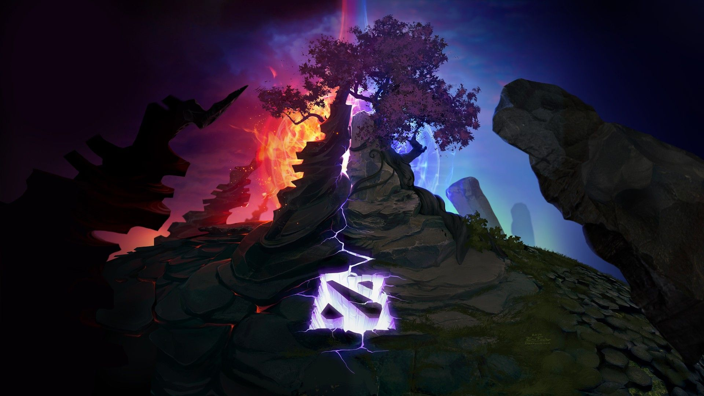
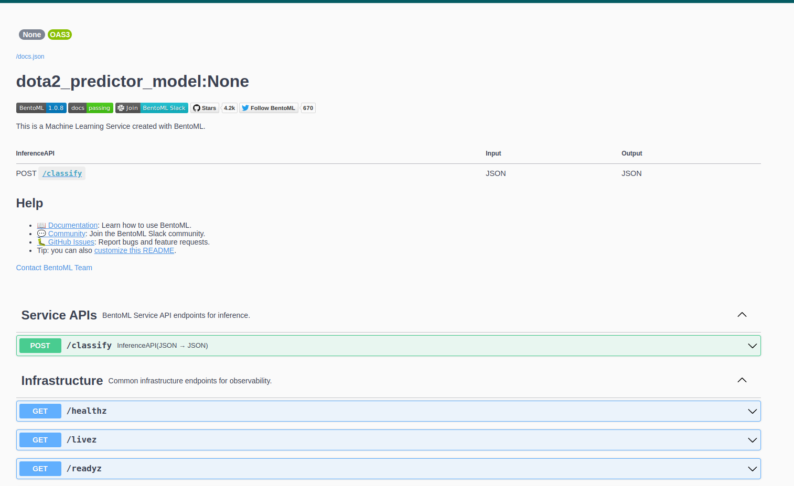
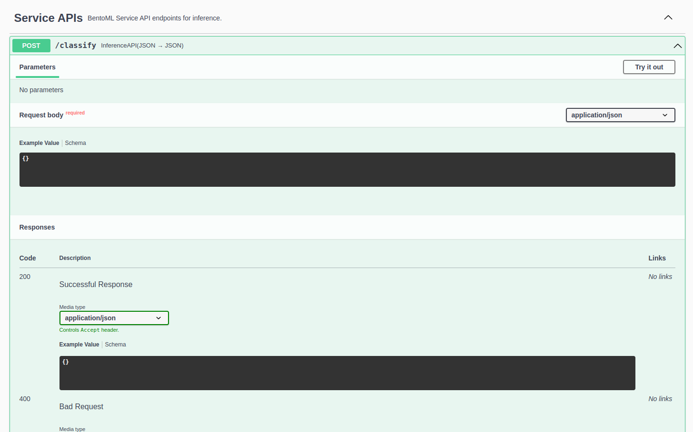
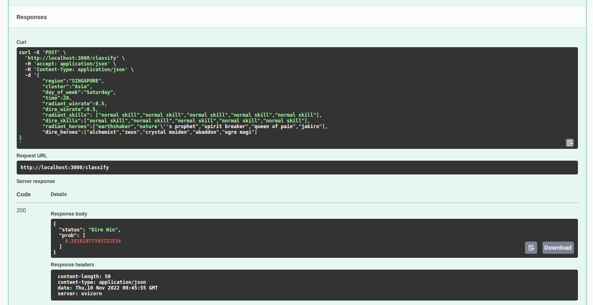
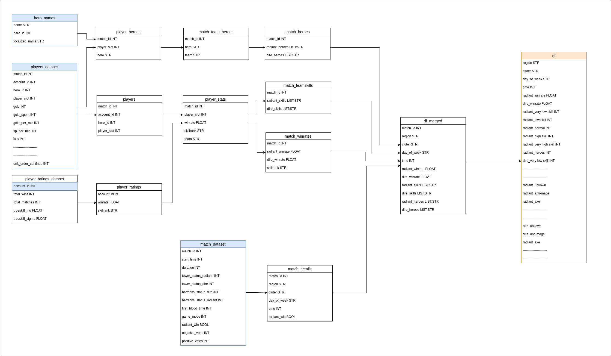
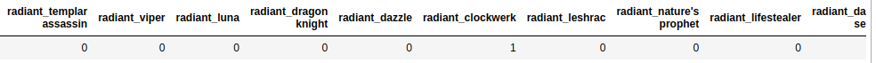
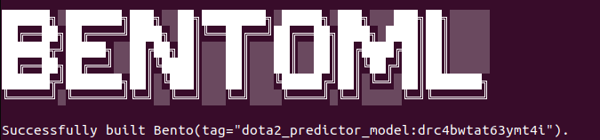

# DOTA 2 RADIANT OR DIRE?

Who do you think will win? Light or Dark? Good or Bad? **RADIANT OR DIRE**? <br>
In this project, we used Machine Learning to predict the winner of a Dota 2 match using pre-game features: region, cluster, time, average winrates, players skills, and player heroes.


<br>

# How to use the Prediction Service?
1. Open the link web service by going to this [link](http://13.228.23.49:3000/). Then BentoML's Swagger UI will appear.<br>
    
2. Go to the "Service APIs" section and click the drop down of the POST /classify.<br>
    
3. Click "Try it out". Input the values for each feature needed for prediction:
    * region
    * cluster
    * day_of_week
    * time
    * radiant_winrate
    * dire_winrate
    * radiant_skills
    * dire_skills
    * radiant_heroes
    * dire_heroes<br>

    Sample Input:  
    ```
    {
        "region":"SINGAPORE",
        "cluster":"Asia",
        "day_of_week":"Saturday",
        "time":20,
        "radiant_winrate":0.5,
        "dire_winrate":0.5,
        "radiant_skills": ["normal skill","normal skill","normal skill","normal skill","normal skill"],
        "dire_skills":["normal skill","normal skill","normal skill","normal skill","normal skill"],
        "radiant_heroes":["earthshaker","nature's prophet","spirit breaker","queen of pain","jakiro"],
        "dire_heroes":["alchemist","zeus","crystal maiden","abaddon","ogre magi"]
    }
    ```
    ```
    {
        "region":"SINGAPORE",
        "cluster":"Asia",
        "day_of_week":"Saturday",
        "time":20,
        "radiant_winrate":0.498238,
        "dire_winrate":0.597404,
        "radiant_skills": ["normal skill","normal skill","normal skill","normal skill","low skill"],
        "dire_skills":["normal skill","normal skill","high skill","normal skill","high skill"],
        "radiant_heroes":["rubick","clockwerk","treant protector","shadow fiend","spectre"],
        "dire_heroes":["ember spirit","abaddon","templar assassin","earthshaker","alchemist"]
    }
    ```
    ```
    {
        "region":"SINGAPORE",
        "cluster":"Asia",
        "day_of_week":"Thursday",
        "time":19,
        "radiant_winrate":0.8,
        "dire_winrate":0.3,
        "radiant_skills": ["normal skill","high skill","high skill","high skill","high skill"],
        "dire_skills":["normal skill","normal skill","high skill","normal skill","high skill"],
        "radiant_heroes":["rubick","clockwerk","treant protector","shadow fiend","spectre"],
        "dire_heroes":["ember spirit","abaddon","templar assassin","earthshaker","alchemist"]
    }
    ```
4. Click "Execute". Go to the responses section. Then, you will see the prediction and the probability (radiant winning the game)<br>
    
<br><br>

# Environment setup
The most important packages we need are:
* pandas
* numpy
* scikit-learn and xgboost
* matplotlib
* bentoml
* docker 

But, you still need to use some of the libraries in the requirements.txt since there are functions used for data cleaning, ML Training and ML deployment,<br>
Make sure to setup your environment first. In this project, we used venv so we just outputted the necessary libraries in the requirement.txt file.
There are several articles and instructions around the internet <br>
on how to setup your virtual environment. Here are some of them:
* venv - https://docs.python.org/3/library/venv.html
* pipenv - https://pipenv.pypa.io/en/latest/
<br><br>

#  Model Training & Deployment  

## Training the Model

### A. Data Preparation
**Data Sources**<br>
The dataset is found in [kaggle](https://www.kaggle.com/datasets/devinanzelmo/dota-2-matches)<br>
**Title**: Dota 2 Matches<br>
**Author**: DEVIN ANZELMO<br>

Specific Datasets Used:<br>
* match_dataset
* player_ratings_dataset
* players_dataset
* hero_name

For the data preparation, we can look into the following data model on how we structure the resulting dataframe used for training from the datasources we have used.<br>
    

**Resulting Dataframe**  
By pre-processing and merging the 4 data sources the data sources, we will get the following features for our resulting dataset:
* region
* cluster
* day_of_week
* time
* radiant_win - target feature
* radiant_winrate
* dire_winrate
* count_mapping of radiant skills based on the ff: ["normal skill","normal skill","normal skill","normal skill","normal skill"]
* count_mapping of dire skills based on the ff: ["normal skill","normal skill","normal skill","normal skill","normal skill"]
* hero_mapping of radiant heroes based on the ff:
    ```
    [
            'Unknown', 'Anti-Mage', 'Axe', 'Bane', 'Bloodseeker', 'Crystal Maiden', 'Drow Ranger',
            'Earthshaker', 'Juggernaut', 'Mirana', 'Morphling', 'Shadow Fiend',
            'Phantom Lancer', 'Puck', 'Pudge', 'Razor', 'Sand King', 'Storm Spirit', 'Sven',
            'Tiny', 'Vengeful Spirit', 'Windranger', 'Zeus', 'Kunkka', 'Lina', 'Lion',
            'Shadow Shaman', 'Slardar', 'Tidehunter', 'Witch Doctor', 'Lich', 'Riki',
            'Enigma', 'Tinker', 'Sniper', 'Necrophos', 'Warlock', 'Beastmaster',
            'Queen of Pain', 'Venomancer', 'Faceless Void', 'Wraith King',
            'Death Prophet', 'Phantom Assassin', 'Pugna', 'Templar Assassin', 'Viper',
            'Luna', 'Dragon Knight', 'Dazzle', 'Clockwerk', 'Leshrac', "Nature's Prophet",
            'Lifestealer', 'Dark Seer', 'Clinkz', 'Omniknight', 'Enchantress', 'Huskar',
            'Night Stalker', 'Broodmother', 'Bounty Hunter', 'Weaver', 'Jakiro',
            'Batrider', 'Chen', 'Spectre', 'Ancient Apparition', 'Doom', 'Ursa',
            'Spirit Breaker', 'Gyrocopter', 'Alchemist', 'Invoker', 'Silencer',
            'Outworld Devourer', 'Lycan', 'Brewmaster', 'Shadow Demon', 'Lone Druid',
            'Chaos Knight', 'Meepo', 'Treant Protector', 'Ogre Magi', 'Undying', 'Rubick',
            'Disruptor', 'Nyx Assassin', 'Naga Siren', 'Keeper of the Light', 'Io',
            'Visage', 'Slark', 'Medusa', 'Troll Warlord', 'Centaur Warrunner', 'Magnus',
            'Timbersaw', 'Bristleback', 'Tusk', 'Skywrath Mage', 'Abaddon', 'Elder Titan',
            'Legion Commander', 'Techies', 'Ember Spirit', 'Earth Spirit', 'Underlord',
            'Terrorblade', 'Phoenix', 'Oracle', 'Winter Wyvern', 'Arc Warden'
        ]
    ```
* hero_mapping of dire heroes based on the ff:
    ```
    [
            'Unknown', 'Anti-Mage', 'Axe', 'Bane', 'Bloodseeker', 'Crystal Maiden', 'Drow Ranger',
            'Earthshaker', 'Juggernaut', 'Mirana', 'Morphling', 'Shadow Fiend',
            'Phantom Lancer', 'Puck', 'Pudge', 'Razor', 'Sand King', 'Storm Spirit', 'Sven',
            'Tiny', 'Vengeful Spirit', 'Windranger', 'Zeus', 'Kunkka', 'Lina', 'Lion',
            'Shadow Shaman', 'Slardar', 'Tidehunter', 'Witch Doctor', 'Lich', 'Riki',
            'Enigma', 'Tinker', 'Sniper', 'Necrophos', 'Warlock', 'Beastmaster',
            'Queen of Pain', 'Venomancer', 'Faceless Void', 'Wraith King',
            'Death Prophet', 'Phantom Assassin', 'Pugna', 'Templar Assassin', 'Viper',
            'Luna', 'Dragon Knight', 'Dazzle', 'Clockwerk', 'Leshrac', "Nature's Prophet",
            'Lifestealer', 'Dark Seer', 'Clinkz', 'Omniknight', 'Enchantress', 'Huskar',
            'Night Stalker', 'Broodmother', 'Bounty Hunter', 'Weaver', 'Jakiro',
            'Batrider', 'Chen', 'Spectre', 'Ancient Apparition', 'Doom', 'Ursa',
            'Spirit Breaker', 'Gyrocopter', 'Alchemist', 'Invoker', 'Silencer',
            'Outworld Devourer', 'Lycan', 'Brewmaster', 'Shadow Demon', 'Lone Druid',
            'Chaos Knight', 'Meepo', 'Treant Protector', 'Ogre Magi', 'Undying', 'Rubick',
            'Disruptor', 'Nyx Assassin', 'Naga Siren', 'Keeper of the Light', 'Io',
            'Visage', 'Slark', 'Medusa', 'Troll Warlord', 'Centaur Warrunner', 'Magnus',
            'Timbersaw', 'Bristleback', 'Tusk', 'Skywrath Mage', 'Abaddon', 'Elder Titan',
            'Legion Commander', 'Techies', 'Ember Spirit', 'Earth Spirit', 'Underlord',
            'Terrorblade', 'Phoenix', 'Oracle', 'Winter Wyvern', 'Arc Warden'
        ]
    ```

### B. Exploratory Data Analysis (EDA)
For the EDA, we have done the following:
* In the data preparation stage, we already conducted some EDA
* Categorization of feature into categorical or numerical:
    * categorical - region, cluster, day_of_week, time, skills of radiant and dire, and heroes of radiant and dire
    * numerical - winrate of radiant and dire
    * both categorical and numerical (for checking purposes) - time
* Risk Ratio and Mutual Info checking for categorical features
* Correlation checking for numerical variables features

### C. Predictive Modelling
The following are the ML Algorithms we used in this project
1. Logistic Regression
2. Decision Tree
3. Random Fores
4. XGBoost

At first, we get the auc scores for each model. Then, we proceeded with hyperparameter tuning for each of the models.<br>
We tried for loops, RandomSearchCV, and manual capturing of parameters

### D. Selection of Best Model
Based from the scores of the trained models, we selected xgboost

### E. Retraining and Evaluation on Test Data
We retrain the model we selected on the full training dataset. The score of using the retrained model is 62.64%.

## Model Deployment
To make the model usable by others, we use bentoml for the deployment.
Steps:
1. Preparing the Model. Save the trained model using the `save_model` caller
    ```
    bentoml.xgboost.save_model('dota2_predictor_model',
                                xgmodel,
                                custom_objects = {'dictVectorizer': dv}
                            )
    ```
2. Using the Model. We can use BentoML APIs in the service.py scripts.
* import the saved model and custom objects (like the dictVectorizer)
* create a model runner via `to_runner` API
* use the runner instance to create the Service
3. Since there is extra-processing done on the desired input for the model. `input_processor` script is created and use as module. This script is used to tranform the list of skills and heroes in appropriate format.
Note: This is the current approach since we cannot directly use the get_dummies or dictVectorizer because 1 match has 5 skills and heroes each for radiant and dire
* get the input of the user
* region, day_of_week, time, and winrate is just the same
* for skills:
    * map the input skills to the complete set of available skills:
        ```
        ['Very Low Skill', 'Low Skill', 'Normal Skill', 'High Skill', 'Very High Skill']
        ```
    * count the number of occurences of a skills in the input skills
    * the desired output would be:  
            
        if the input is ["normal skill","normal skill","normal skill","normal skill","normal skill"],  
        Output would be:  
            - 1 radiant_low skill    
            - 4 radiant_normal skills  
            - 0 for other skills columns
        
* for heroes:
    * map the input skills to the complete set of available heroes: 
        ```
        [
            'Unknown', 'Anti-Mage', 'Axe', 'Bane', 'Bloodseeker', 'Crystal Maiden', 'Drow Ranger',
            'Earthshaker', 'Juggernaut', 'Mirana', 'Morphling', 'Shadow Fiend',
            'Phantom Lancer', 'Puck', 'Pudge', 'Razor', 'Sand King', 'Storm Spirit', 'Sven',
            'Tiny', 'Vengeful Spirit', 'Windranger', 'Zeus', 'Kunkka', 'Lina', 'Lion',
            'Shadow Shaman', 'Slardar', 'Tidehunter', 'Witch Doctor', 'Lich', 'Riki',
            'Enigma', 'Tinker', 'Sniper', 'Necrophos', 'Warlock', 'Beastmaster',
            'Queen of Pain', 'Venomancer', 'Faceless Void', 'Wraith King',
            'Death Prophet', 'Phantom Assassin', 'Pugna', 'Templar Assassin', 'Viper',
            'Luna', 'Dragon Knight', 'Dazzle', 'Clockwerk', 'Leshrac', "Nature's Prophet",
            'Lifestealer', 'Dark Seer', 'Clinkz', 'Omniknight', 'Enchantress', 'Huskar',
            'Night Stalker', 'Broodmother', 'Bounty Hunter', 'Weaver', 'Jakiro',
            'Batrider', 'Chen', 'Spectre', 'Ancient Apparition', 'Doom', 'Ursa',
            'Spirit Breaker', 'Gyrocopter', 'Alchemist', 'Invoker', 'Silencer',
            'Outworld Devourer', 'Lycan', 'Brewmaster', 'Shadow Demon', 'Lone Druid',
            'Chaos Knight', 'Meepo', 'Treant Protector', 'Ogre Magi', 'Undying', 'Rubick',
            'Disruptor', 'Nyx Assassin', 'Naga Siren', 'Keeper of the Light', 'Io',
            'Visage', 'Slark', 'Medusa', 'Troll Warlord', 'Centaur Warrunner', 'Magnus',
            'Timbersaw', 'Bristleback', 'Tusk', 'Skywrath Mage', 'Abaddon', 'Elder Titan',
            'Legion Commander', 'Techies', 'Ember Spirit', 'Earth Spirit', 'Underlord',
            'Terrorblade', 'Phoenix', 'Oracle', 'Winter Wyvern', 'Arc Warden'
        ]
        ```
    * count the number of occurences of a skills in the input skills
    * the desired output would be:  
          
        if the input is ["earthshaker","nature's prophet","spirit breaker","queen of pain","jakiro"],  
        Output would be:  
            - 1 radiant_earthshaker  
            - 1 radiant_nature's prophet  
            - 1 radiant_spirit breaker  
            - 1 radiant_queen of pain  
            - 1 radiant_jakiro  
            - 0 for the rest of heroes columns  
4. Once the service.py and input_processor.py is created, we can now build out bento:
* Create bentofile.yaml and specify the needed libraries
    ```
    service: "service.py:svc" # Specify entrypoint and service name
    labels: # Labels related to the project for reminder (the provided labels are just for example)
    owner: Christian Balanquit
    project: Dota2_ML_Project
    include:
    - "*.py" # A pattern for matching which files to include in the bento build
    python:
    packages: # Additional pip packages required by the service
        - xgboost
        - scikit-learn
        - pandas
    ```
* Run the command `bentoml build`. Then save the tag of the built bento (e.g. dota2_predictor_model:drc4bwtat63ymt4i in the image below)  
      

5. Once our bento is built, we can now deploy it locally or in the cloud.
* Local Deployment using Docker
    - build the docker image using the command `bentoml containerize <bentoml_model_name>:<model_name>`.  
    In this instance case `bentoml containerize dota2_predictor_model:drc4bwtat63ymt4i`
    - Once the docker image is built, use the command `docker run -it --rm -p 3000:3000 containerize <bentoml_model_name>:<model_name>` to test if everything is working fine. 
* Cloud Deployment using AWS Elastic Container Service (ECS)
    - refer to this [link](https://github.com/alexeygrigorev/mlbookcamp-code/blob/master/course-zoomcamp/07-bentoml-production/06-production-deployment.md) for the detailed instructions on how to deploy the model in AWS

Limitations and Further Features/Improvements:
1. In this predictor, we just use the pre-game information a dota team or player can have like the (1) region, day_of_week, and time of the day, (2) the average winrate of the radiant and dire players, and the (3) skill levels and heroes of the radiant and dire players. This information will not really dictate the result of a game/match since Dota is a really complex game. What we can do is to also add a In-game Winner Predictor which will predict the probable winner based on the gold, hero experience, KDA, towers destroyed on a given time
2. We can also try to gather more data with more representation for each heroes
3. We can also go back to the model training and deployment
4. We can try to deploy it in other cloud provider like Azure or GCP
